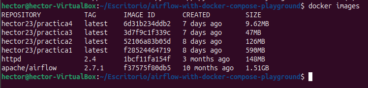

# Apache Airflow Playground

## Estructura de directorios

Ejecutamos el comando **ls** para revisar la estructura que debe coincidir con la siguiente

```
.
├── README.md
├── docker-compose.yaml
├── .env
├── dags/
│   └── population_pipeline.py
└── outputs/
    └── .gitignore
```

## Requisitos previos
- Docker
- Docker Compose
- Git

## Revisamos las versiones ejecutando los comandos

**Docker**
```
docker --version
```


**Docker Compose**
```
docker compose --version
```


**Git**
```
git --version
```


## Puesta en marcha

1. Iniciar los servicios:
```bash
docker-compose up -d
```


Revisamos que exista la imagen ejecutando el siguiente comando:
```bash
docker ps -a
```


Revisamos que exista el contenedor ejecutando el siguiente comando:
```bash
docker images
```



2. Ver los logs (incluye la contraseña de admin):
```bash
docker-compose logs airflow
```


Se nos muestra que la contraseña para el usuario **admin** es **6mhF747TCazWph76**

*Si no se muestra la contraseña del usuario **admin** se ejecuta el siguiente comando para filtrar la busqueda:*
```bash
 docker-compose logs airflow | grep admin
```


3. Acceder a la interfaz web:
- URL: http://localhost:8001


- Usuario: admin
- Contraseña: buscar en los logs la línea que contiene "admin:password"


## Verificar resultados

1. Ver el resultado en outputs:
```bash
cat outputs/report.txt
```

Al ejecutarlo me ha aparecido el siguiente error


*Para corregirlo he ejecutado los siguientes comandos:*
```bash
chmod 775 outputs
ls -ld outputs
```
*Donde se dan permisos de lectura, escritura y ejeccución a outputs, y luego revisamos que los permisos se hayan actualizado.*

Lo volvemos a ejecutar para mostrar **report.txt**
```bash
cat outputs/report.txt
```


2. O acceder directamente al contenedor:
```bash
docker-compose exec airflow bash
cat /tmp/report.txt
```


## Detener los servicios

```bash
docker-compose down
```


## Comandos útiles

- Ver logs en tiempo real:
```bash
docker-compose logs -f
```


- Reiniciar servicios:
```bash
docker-compose restart
```


- Limpiar todo (incluyendo volúmenes):
```bash
docker-compose down -v
```

# Nuevo DAG

Creamos un nuevo DAG que descarge datos de dos fuentes distintas, hace un merge de ambas y por ultimo genera un informe.

El nuevo dataset que hemos añadido es: https://github.com/datasets/world-cities/blob/main/data/world-cities.csv

En formato RAW: https://raw.githubusercontent.com/datasets/world-cities/refs/heads/main/data/world-cities.csv

Volvemos a iniciar los servicios:
```bash
docker-compose up -d
```


Vemos los logs para conocer la contraseña del usuario **admin**
```bash
docker-compose logs airflow
```


Se nos muestra que la contraseña para el usuario **admin** es **fkqYvKzbyvFCAcyx**

Accedemos a la interfaz web (http://localhost:8001) e iniciamos sesión con los credenciales obtenidos anteriormente


Mostramos los outputs:
```bash
cat outputs/report.txt
```


```bash
cat outputs/merged_report.txt
```


Otra forma es acceder directamente al contenedor:
```bash
docker-compose exec airflow bash
cat /tmp/report.txt
```


```bash
docker-compose exec airflow bash
cat /tmp/merged_report.txt
```


